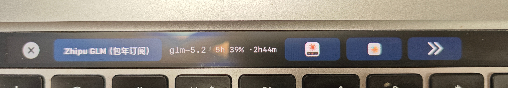

# cc-touchbar



Claude Code 的 Touch Bar HUD：在 MacBook Touch Bar 上显示当前 provider、模型、订阅余额、会话状态等信息，并支持一键切换 cc switch provider、激活对应终端窗口。

仅支持带 Touch Bar 的 MacBook：

- MacBook Pro 2016–2019 (Intel)
- MacBook Pro 2020 (M1, 13-inch)


## 功能速览

- **Touch Bar HUD**：provider / 模型 / 订阅余额 / 上下文用量 `ctx 78%` / 累计 billed tokens `Σ 1.2M ⚡92%` / thinking 预算 / cc-touchbar 与 cc switch 快捷按钮
- **三层数据源**：自动识别官方订阅 / 第三方 env vars / cc switch（详见 [数据源策略](docs/03-数据源策略.md)）
- **DFR 常驻**：HUD 通过私有 DFR API 系统级呈现，Control Strip 里常驻 tray 图标，切到其它 app 也显示
- **多会话追踪**：基于 Claude Code hooks 实时同步会话状态；主窗口列表支持点击激活对应终端
- **主题**：内置深色 / 浅色两套；切换后立即应用到 Touch Bar
- **诊断面板**：展示路径、数据源、hook 状态等，便于排障

完整设计文档：**[docs/README.md](docs/README.md)**>

## 下载

到 [Releases](../../releases) 下载最新 `cc-touchbar-unsigned.zip`，解压后得到 `cc-touchbar.app`。

## 首次打开（未签名 app）

未签名 app 首次打开会被 macOS Gatekeeper 拦下。任选一种方式放行：

**方式一：右键打开**

1. 在 Finder 里右键 `cc-touchbar.app`
2. 选「打开」
3. 在弹出的警告框里再点「打开」

**方式二：终端去除隔离属性**

```bash
xattr -dr com.apple.quarantine /path/to/cc-touchbar.app
```

## 本机构建

```bash
brew install xcodegen
xcodegen
xcodebuild \
  -project cc-touchbar.xcodeproj \
  -scheme cc-touchbar \
  -configuration Release \
  -derivedDataPath build \
  CODE_SIGN_IDENTITY="-" \
  CODE_SIGNING_REQUIRED=NO \
  CODE_SIGNING_ALLOWED=NO \
  build
```

产物在 `build/Build/Products/Release/cc-touchbar.app`。

## 发布新版本

打 tag 触发 GitHub Actions 自动构建并发布到 Releases：

```bash
git tag v0.0.1
git push origin v0.0.1
```

CI 会自动构建未签名 zip，创建 Release，并附上自动生成的 changelog。tag 名带 `-`（如 `v0.0.1-rc1`）会标记为 prerelease。


🙏 致谢
感谢真诚、友善、团结、专业的 LinuxDo 社区，让我学到那么多有关 AI 相关知识。

LinuxDo — 学 AI, 上 L 站!